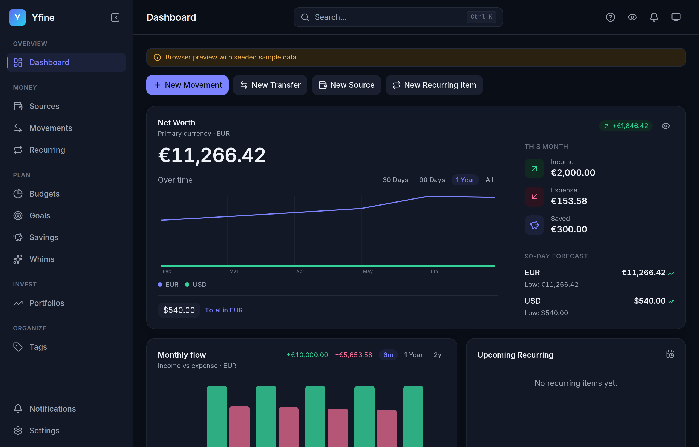
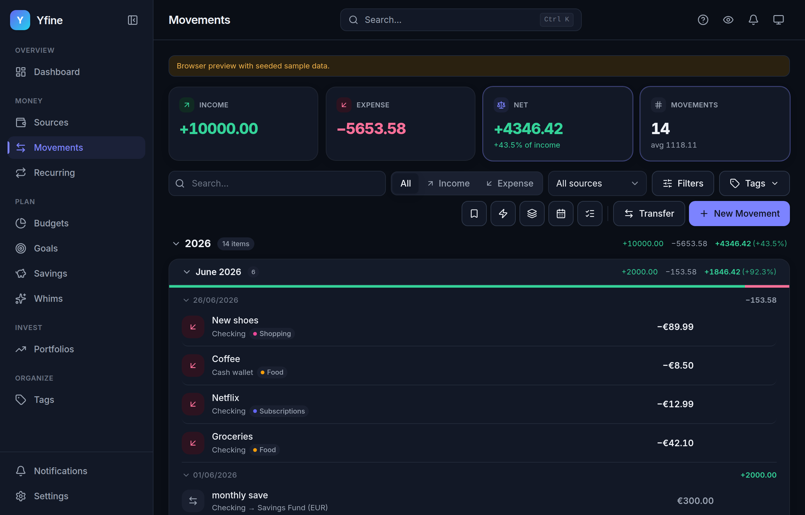
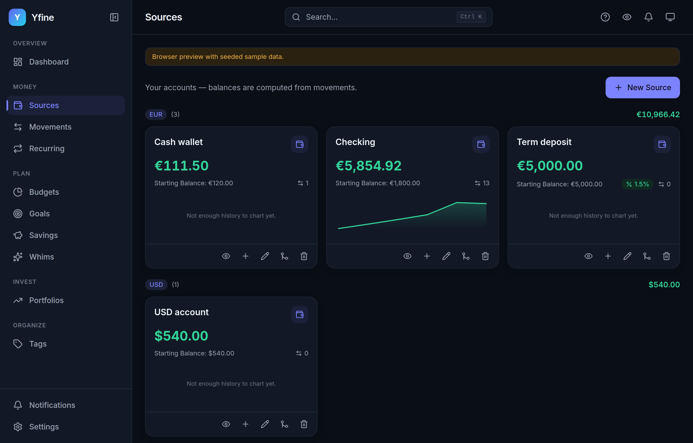
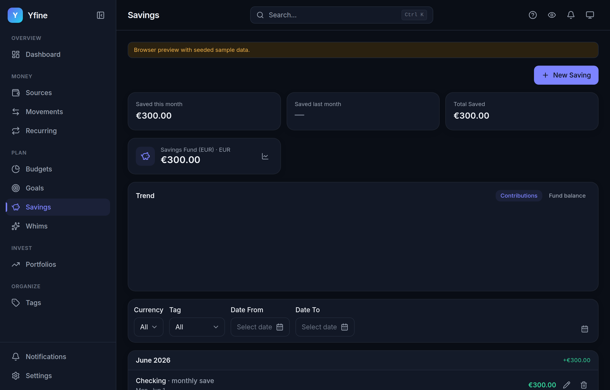
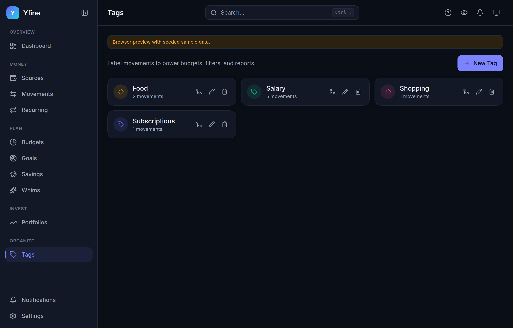
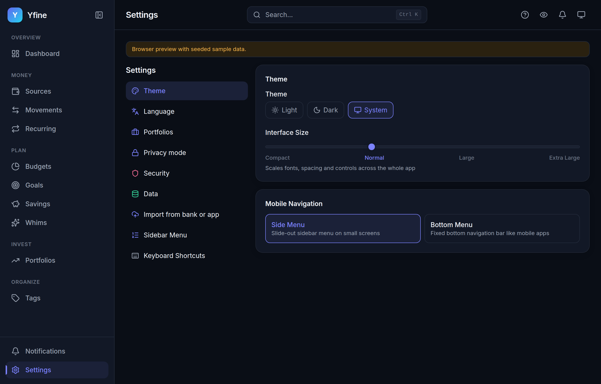

# Yfine

A private, **local-first** personal-finance desktop app — track wallets, movements,
transfers, recurring bills, savings, goals, budgets and portfolios entirely on your
own machine. No cloud, no accounts, no sign-up.

Native desktop app built with **Tauri 2 + React + TypeScript**, talking directly to
a local **SQLite** database. Your data never leaves your computer unless you
explicitly turn on optional online price lookups (see [Privacy & network](#privacy--network)).

> Copyright © 2026 AlexDevFlow · Licensed under **GPL-3.0-or-later** (see [LICENSE](LICENSE)).

---

## Screenshots

| | |
|---|---|
|  |  |
| **Dashboard** — net worth per currency, monthly flow, 90-day forecast | **Movements** — grouped by day, filters, split transactions, bulk edit |
|  |  |
| **Sources** — multi-currency wallets, balances derived from movements | **Savings** — real savings funds tracked over time |
|  |  |
| **Tags** — colour-coded labels that power budgets & filters | **Settings** — theme, language, security, import & export |

## Download & install

Grab the installer for your OS from the [**Releases**](https://github.com/AlexDevFlow/yfine2/releases) page.

The binaries are **not code-signed** (this is a free, open-source app), so each OS
shows a one-time "unknown developer" warning on first launch. That's expected — here's
how to get past it:

### macOS — `Yfine_x.y.z_universal.dmg`
Universal build (Intel + Apple Silicon). Open the `.dmg`, drag **Yfine** to
`/Applications`. On first launch macOS blocks it:

- **Right-click** the app → **Open** → **Open** in the dialog, **or**
- run once in Terminal:
  ```sh
  xattr -dr com.apple.quarantine /Applications/Yfine.app
  ```

### Windows — `Yfine_x.y.z_x64-setup.exe` / `.msi`
Run the installer. SmartScreen may say "Windows protected your PC" → click
**More info** → **Run anyway**.

### Linux — `.AppImage` or `.deb`
- **AppImage:** `chmod +x Yfine_*.AppImage` then run it.
- **Debian/Ubuntu:** `sudo dpkg -i Yfine_*.deb` (or open with your package manager).

---

## Features

- **Dashboard** — net worth per currency (+ optional consolidated total), this-month
  in/out/saved, monthly-flow chart, recent movements, and a 90-day cashflow forecast.
- **Sources** — multi-currency accounts with derived balances, savings funds, periodic yield.
- **Movements** — in/out, cross-currency transfers, split transactions, filters,
  grouped by day, bulk edit (delete/move).
- **Recurring** — auto/confirm schedules with a background reconciliation on launch.
- **Budgets / Goals / Whims** — tag budgets with rollover, savings goals, prioritised wishlist.
- **Portfolios** — holdings with FX-correct valuation; optional live prices (off by default).
- **Data** — `.yfine`/JSON backup & restore, CSV bank import (Revolut/N26/YNAB/PayPal/Firefly),
  CSV / Excel / PDF export.
- **Security** — optional password with AES-256-GCM at-rest encryption (PBKDF2; also reads
  legacy Fernet archives).
- Light/dark themes, four languages (en/it/es/uk), ⌘K command palette.

---

## Your data

Yfine stores everything in a local SQLite database in your OS app-data directory —
nothing is uploaded. If you set a password, the database is encrypted at rest
(AES-256-GCM) and decrypted into a working file only while the app is open.

It keeps the **same schema** as the original Yfine, so an existing `yfine.db` (or an
encrypted `yfine.db.enc`) migrates unchanged: the drift-tolerant migrator adds any
missing tables/columns additively and never drops data.

---

## Privacy & network

**Yfine sends no telemetry and makes zero network requests by default.** Everything
works fully offline.

Two **opt-in** features reach the internet only when you turn them on:

- **Live prices** (portfolios): fetches quotes from CoinGecko and Yahoo Finance.
- **On-chain balance watch**: queries a public blockchain RPC (blockstream.info for
  BTC, a public Ethereum RPC, Solana mainnet) for an address you add. Note that this
  sends the **public wallet address** you're watching to that third-party endpoint,
  which can correlate it with your IP. Don't enable it if that matters to you.

The portfolio screen can also embed a TradingView chart widget, which loads from
TradingView when shown.

No accounts, no analytics, no background phone-home.

---

## Build from source

Prerequisites: **Rust** (stable), **Node 20+**, **pnpm 10+**, and the Tauri 2
platform dependencies for your OS (on Debian/Ubuntu: `libwebkit2gtk-4.1-dev
libappindicator3-dev librsvg2-dev patchelf build-essential`). See the
[Tauri prerequisites](https://v2.tauri.app/start/prerequisites/) guide.

```sh
pnpm install
pnpm tauri build    # installers land in src-tauri/target/release/bundle/
```

## Develop

```sh
pnpm dev            # browser preview at http://localhost:1420 (in-memory sql.js, seeded sample data)
pnpm tauri dev      # the real native window (SQLite on disk); first run compiles Rust
pnpm test           # vitest — domain + repositories
pnpm typecheck      # tsc --noEmit
```

The browser preview uses an in-memory sql.js database so the whole UI is explorable
without the native runtime. The packaged app uses native SQLite.

---

## Releasing (maintainers)

CI ([`.github/workflows/release.yml`](.github/workflows/release.yml)) builds Linux,
Windows, and a universal macOS installer on a `v*` tag, then creates a **draft**
GitHub Release with the artifacts attached. Steps:

1. Bump the version in **all three** manifests so they match the tag:
   `package.json`, `src-tauri/tauri.conf.json`, and `src-tauri/Cargo.toml`.
2. Commit, then tag: `git tag v0.1.0 && git push origin v0.1.0`
   (or trigger the workflow manually via **Actions → Run workflow**).
3. Wait for all three OS builds to finish, then review and **publish** the draft Release.
4. Sanity-check that each installer launches on its OS before announcing.

Binaries are unsigned by design; the install instructions above cover the first-launch bypass.

---

## License

[GPL-3.0-or-later](LICENSE). You're free to use, study, modify, and redistribute it;
redistributed versions must remain under the same license and offer their source.
